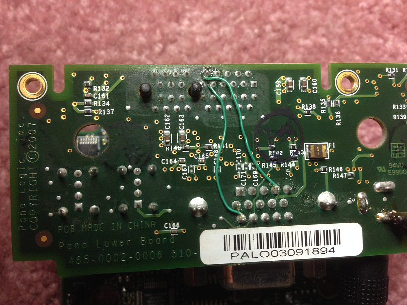
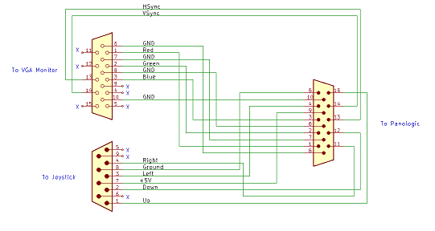
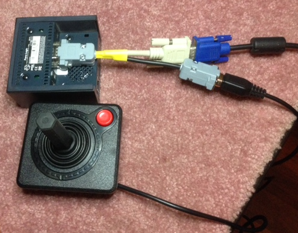

#  

## PanoMan 
This project simulates the classic Pacman arcade game on a first generation PanoLogic thin client.  

Why? 
I absolutely love hacking surplus gear for new purposes, that and I spent way too much time playing Pacman in my youth.  I was also interested in learning Verilog and/or VHDL but now that I've played around with SpinalHDL I'm hooked.

This project is a Frankenstein's monster of code from many different places written in 3 different HDLs: VHDL, Verilog and SpinalHDL.  Additionally the project combines a modern RISC-V processor with a archaic Z80.  Amazingly enough it was fairly easy to get everything working together largely thanks to SpinalHDL.

## Heritage
 This project is essentially a small layer of "glue" code that ties together the work of others including:

* Tom Verbeure's ray tracer [project](https://github.com/tomverbeure/rt) which was used as the basic infrastructure to quickly get code up and running on the Pano.
* [Mike J's](http://www.fpgaarcade.com/author/mikej/) simulation model of the Pacman hardware in VHDL for the Spartan 3E.
* The [Papilio-Arcade](https://github.com/GadgetFactory/Papilio-Arcade.git) project modifications of MikeJ's project for the Papilio platform.  
* Daniel Wallner's Z80 CPU [core](https://opencores.org/projects/tv80).
* Tom Verbeure's amazing reverse engineering efforts and Pano logic [bring up](https://github.com/tomverbeure/panologic) code.
* The [SpinalHDL](https://github.com/SpinalHDL) project.

## Why a RISC-V ??

The sound subsystem in the Pano is based on a codec from Wolfson which must be initialized before it can be used.  I had no interest creating hardware to do the initialization so that leaves software.  I had even less interest in trying to patch the Pacman Z80 ROMs so ... just drop in a 32 bits processor, since it was easy (*REALLY EASY* since Tom did all the work so it was already there).

## HW Requirements

* A Pano Logic G1 (the one with a VGA port)
* A suitable 5 volt power supply
* A JTAG programmer to load the bitstream into the FPGA.

If you want to actually be able to play a game you'll also need:

* A switch style joystick.
* Soldering skills to connect the joystick to the Pano.

## Software Requirements

The free Webpack version of Xilinx [ISE 14.7](https://www.xilinx.com/support/download/index.html/content/xilinx/en/downloadNav/design-tools/v2012_4---14_7.html) is needed to program the Pano device. This will also allow you regenerate the .bit file from VHDL and Verilog sources.  Do **NOT** download the latest Windows 10 version as it does not support the Spartan 3E family of chips used in the first generation of the Pano device.

Either Windows or Linux can be used to recreate the .bit file if the ROMs are updated, but Linux is probably necessary to make wider changes to the project.

If you simply want to run the pong demo on your Pano, then all you need to do is load a pre-made [bitstream](./xilinx/Pano.bit) into the device usings Xilinx's Impact tool.

## ROMs

For legal reasons the Pacman ROM images are **NOT** included in this project, instead David Widel's Pong demo written for the same hardware has been provided. 

In order to run the Pacman you will need to create ROM image files from an actual arcade game or download the images from elsewhere on the Internet.  These are the same files needed by the infamous [Mame project](https://www.mamedev.org/) so they should be relatively easy to locate. 


## Joystick Interface
Video and sound weren't much of a challenge since Tom Verbeur had already done all of the ground work there.  

The joystick, coin detector, and start buttons on the other hand presented a bit of a challenge. Normally a Pacman game needs 8 GPIO inputs:

1. Two inputs for the two coin slots.
1. One input for the 1 player game start button.
1. One input for the 2 player game start button.
1. Four inputs for the joystick.

The obvious way to connect a Joystick to the Pano is to use one of the USB ports, but that's a problem because there's no code for the USB port yet and it looks like a major undertaking.   

Another solution would be to use an I2C port expander, but this would require something to be built along with code to poll it and it would not be easy to house it in the tiny Pano case.

The Pano does have some signals that are relatively easy to access that could be considered GPIOs.  Three are used to drive the 3 LEDs, one is used to read the"Pano" button, and 2 are connected to the VGA monitors Display Data Channel (DDC) port. This get us close. 

One surprise was that unlike the green and blue LED ports the red LED port can't be used as an input without hardware modifications.  Apparently the red LED is not driven directly by a Xilinx pin.

It turns out that there is a "DIP" switch setting that configured the Pacman machine for free plays.  By selecting this mode we eliminate the need for the coins slot inputs.

The 2 player start button isn't essential so we can skip it and thus get down to 5 inputs for the Joystick and start button.  The start button is easy, we'll just use the existing "Pano" button for it.

This leaves us with 4 inputs we need to connect to our joystick.  For the impatient person who isn't concerned about esthetics or physical robustness flying wires are a quick and easy way to hook up the joystick.

I choose to use a connector to make things more robust, neat and tidy.  Since the case is so small adding a connector isn't really an option, however two of the signals are already on the VGA connector and the VGA connector has just enough spare pins for the other two! 

 Adding two jumper wires from the VGA connector from the LEDS is pretty easy to do with any soldering skills at all.  Here's the result:
 
 

Then we can make a Y cable to combine the joystick and VGA cables.  Note: The pinout of the DB9 connector matches the pinout of the Atari 2600 joystick.


| Signal | Pano | Monitor | Joystick |
|---------|--------|-----------|------------|
| red | 1  |1 | -|
| green | 2 | 2|-|
|blue|3|3|-|
|blue led/left|4|-|3|
|gnd|5|-|8|
|gnd|6|6|-|
|gnd|7|7|-|
|gnd|8|8|-|
|+5V|9|-|7|
|gnd|10|10|-|
|green led/right|11|-|4|
|VGA SDA/down|12|-|2|
|Hsync|13|13|-|
|Vsync|14|14|-|
|VGA SCL/up|15|-|1|
|B input paddle|-|-|5|
|Trigger input|-|-|6|
|A input paddle|-|-|9|



 

## Updating ROMs
To update the bitstream with new ROMs:

1. Place the ROM images in ~/pano_man/src/main/roms.
2. Run "./build_roms_pacman.sh" (or build_roms.bat on Windoze) from the ~/pano_man/src/main/pacman subdirectory.
4. Start ISE.
5. From the ISE IDE select "Pano" from the Design/Hierarchy window.
6. Right click on "Generate Programming File" in the Design/Processes windows and then select "Rerun All".
7. Go get coffee while you wait for the programming file (pano.bit) to be generated.
8. Select iMpact from the Tools menu, click "Ok", to dismiss the warning dialog.


## Building Everything from Scratch

**NB:** While it may be possible to use Windows for development I haven't tried it and don't recommend it.

* Install RISC-V GCC compiler suite

See the [picorv32](https://github.com/cliffordwolf/picorv32) github project on how to do it.  Warning: this make take a long time to complete!

* Install [SpinalHDL](https://github.com/SpinalHDL/SpinalHDL)

The actual installation instructions can be found in the [VexRisc]( https://github.com/SpinalHDL/VexRiscv#dependencies) project.

* Clone this github repository into `~/pano_man`
* Change into the root of the repository `~/pano_man`

* Build the firmware for the RISC-V processor

```
(cd sw;make)
```
This creates a file called `~/pano_man/sw/progmem8k.bin`

* Build the Verilog for synthesis

When you run this, not only will you create the `Pano.v` file, but also a bunch of `.bin` files that contain RAM initialization contents, which will be loaded by Xilinx ISE during synthesis.

```
make syn
```

* Fire up Xilinx ISE
```
cd xilinx
make ise
```

* Create the bitstream

    * File -> Open Project -> ~/pano_man/xilinx/panoman.xise
    * Double click on 'Generate Programming File'


* Fire up Xilinx Impact

```
cd ~/pano_man/xilinx
make impact
```

* Load bitstream into the device

    <To be done>

## Possible Future Projects

* Add support for MCP23017 I2C port expander to provide support for 2 player mode and coin slots

* Add support for saving the high score in SPI flash
* Port code to the [second generation](https://github.com/tomverbeure/panologic-g2) of the Pano
* Once basic USB support is available add support for USB Joysticks

* Port other games that ran on the same hardware such as Invaders and Galaxian